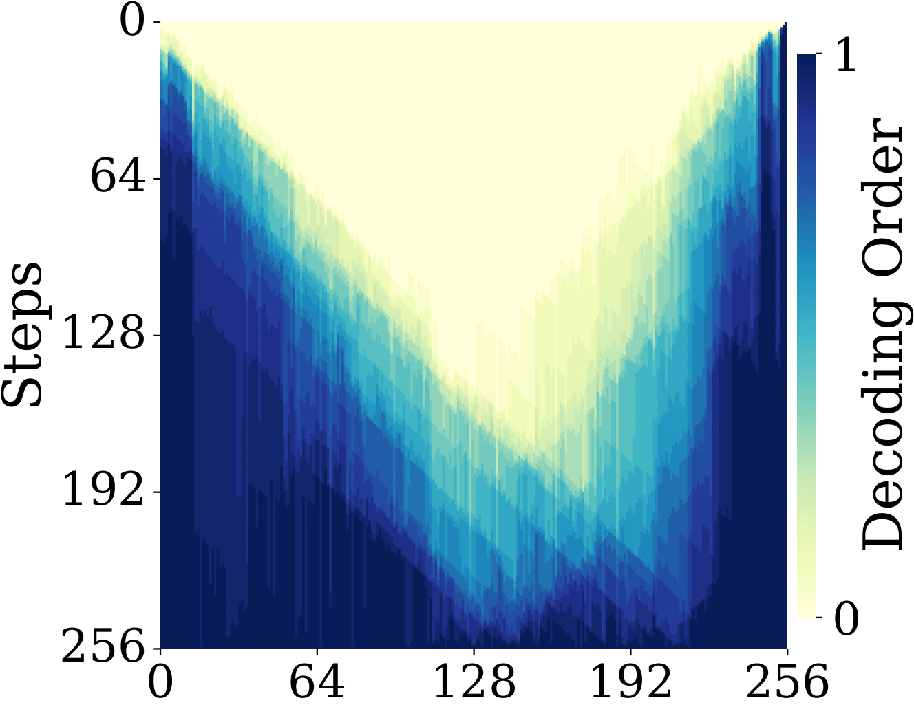
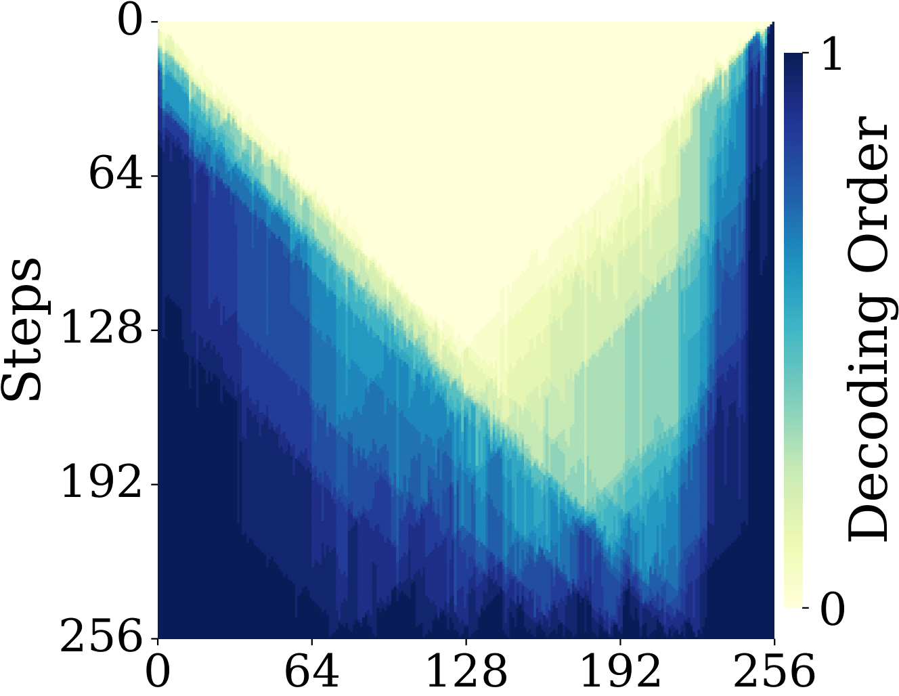
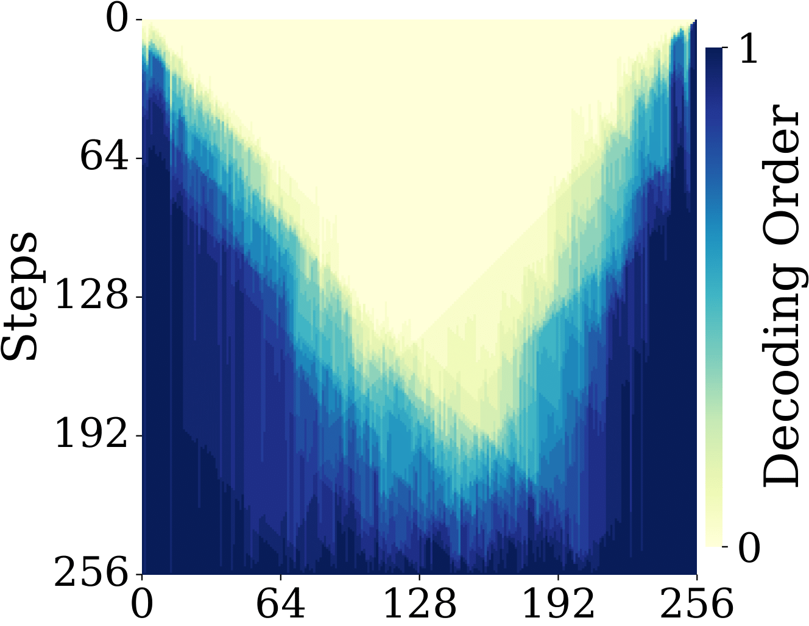
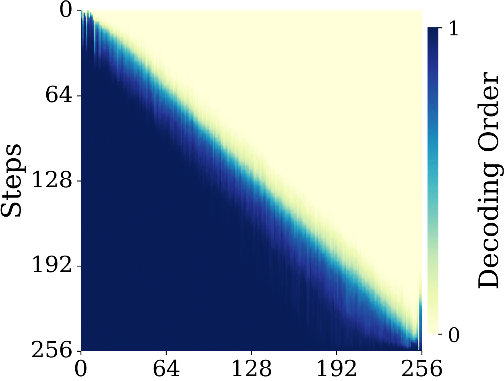

# PC-Sampler: Position-Aware Calibration of Decoding Bias in Masked Diffusion Models
[](https://github.com/NEUIR/PC-Sampler)

<p align="center">•
 <a href="#-introduction"> 📖 Introduction </a> •
 <a href="#-news">🎉 News</a> •
 <a href="#-PC-Sampler-pipeline">✨ PC-Sampler Pipeline</a> •
 <a href="#%EF%B8%8F-evaluation">⚡️ Evaluation</a> 
</p>
<p align="center">•
 <a href="#-decoding trajectory">📈 Decoding Trajectory</a> •
 <a href="#-algorithm">💻 Algorithm</a> •
 <a href="#-license">📄 Lisense</a> •
 <a href="#-contact">📧 Contact</a> •
 <a href="#-star-history">📈 Star History</a>
</p>

# 📖 Introduction
**PC-Sampler** is a novel decoding strategy for Masked Diffusion Models (MDMs) that unifies global trajectory planning with content-aware informativeness maximization. It addresses the key limitations of traditional uncertainty-based samplers: a lack of global trajectory control and a bias toward "trivial tokens." By using a position-aware weighting mechanism and a calibrated confidence score, PC-Sampler guides the decoding path and prevents the premature selection of unimportant tokens, significantly improving generation quality.

# 🎉 News

<!-- * 20241111: Released our [VisRAG Pipeline](https://github.com/OpenBMB/VisRAG/tree/master/scripts/demo/visrag_pipeline) on GitHub, now supporting visual understanding across multiple PDF documents. -->

# ✨ PC-Sampler Pipeline

## PC-sampler

**PC-sampler** is a novel decoding strategy designed for advanced Masked Diffusion Models (MDMs) like [LLaDA](https://huggingface.co/GSAI-ML/LLaDA-8B-Instruct) and [Dream](https://huggingface.co/Dream-org/Dream-v0-Instruct-7B). These models are powerful non-autoregressive alternatives for sequence generation, enabling flexible decoding through the iterative denoising of masked tokens.

# ⚙️ Setup

```bash
git clone 
conda create --name pc_sampler python==3.10
conda activate pc_sampler
cd PC_Sampler
pip install -r requirements.txt
```

# 📃 Evaluation

Our method, along with all baseline methods, can be applied for prediction across mathematical reasoning, code generation, and question-answering datasets.

### Eval Case

This is an example of evaluation on the HumanEval dataset using PC-sampler.
And you can run the change the `--task` and `--mode` to evaluate on other datasets and decoding methods.

```bash
cd scripts
python eval.py \
    --task 'humaneval' \
    --model_name 'GSAI-ML/LLaDA-8B-Instruct' \
    --device 'cuda:5' \
    --gen_length 256 \
    --steps 256 \
    --block_length 256 \
    --mode pc_sampler \
    --lambd 0.25 \
    --alpha 10 \
    --data_path ../data/humaneval.jsonl \
    --result_path results/humaneval_pc_sampler
```

Following are the evaluation bash scripts for all decoding methods.

| Decoding Method       | Evaluation Command                                                                 | Decoding Method       | Evaluation Command                                                                 |
|-----------------------|-------------------------------------------------------------------------------------|-----------------------|-------------------------------------------------------------------------------------|
| Semi-Autoregressive   | <pre style="white-space: pre-wrap; margin:0;">cd scripts<br>bash eval_semi_ar.sh</pre> | Entropy               | <pre style="white-space: pre-wrap; margin:0;">cd scripts<br>bash eval_entropy.sh</pre> |
| EB-Sampler            | <pre style="white-space: pre-wrap; margin:0;">cd scripts<br>bash eval_eb_sampler.sh</pre> | Fast-dLLM             | <pre style="white-space: pre-wrap; margin:0;">cd scripts<br>bash eval_fast_dllm.sh</pre> |
| Margin                | <pre style="white-space: pre-wrap; margin:0;">cd scripts<br>bash eval_margin.sh</pre> | PC-sampler            | <pre style="white-space: pre-wrap; margin:0;">cd scripts<br>bash eval_pc_sampler.sh</pre> |

### Evaluation of Decoding Methods
All decoding methods are evaluated on the same set of datasets: **HumanEval**, **MBPP**, **GSM8K**, **MATH-500**, **GPQA**, **Countdown**, and **Sudoku**. Evaluation results are saved in the `results` folder.

#### Evaluation Tools
- For the **GSM8K** and **GPQA** datasets, we use `lm-eval` for evaluation.
- For the remaining datasets, we use a custom evaluation script. Please refer to `scripts/eval.py` for more details.

#### Consistency Note
All methods are evaluated using the same set of evaluation scripts (including both `lm-eval` and our custom script) to ensure consistent assessment.

# 📈 Decoding Trajectory

The choice of decoding strategy significantly impacts the generation order of Masked Diffusion Models (MDMs). A critical limitation of existing uncertainty-based methods is their tendency to exhibit a "U-shaped" trajectory, where tokens at sequence boundaries are prioritized early in decoding, followed by convergence toward the center . This pattern arises from the greedy nature of these samplers and the model's propensity to assign high confidence to structurally predictable boundary tokens .

In contrast, our PC-Sampler introduces explicit trajectory control through position-aware weighting, enabling adaptive generation order tailored to task requirements. Below, we visualize the decoding trajectories on the GSM8K dataset for four representative sampling strategies:

## 🔍 Trajectory Visualizations on GSM8K  

| Sampling Strategy   | Decoding Trajectory Heatmap   | Sampling Strategy   | Decoding Trajectory Heatmap   |
|---------------------|-------------------------------|---------------------|-------------------------------|
| Confidence-based    |       | Entropy-based       |          |  
| Margin-based        |           | linear position   |       |  

## 🔑 Key Observations

- **U-shaped Bias in Uncertainty-based Methods**: Confidence, entropy, and margin-based samplers consistently exhibit the characteristic U-shaped pattern, with early decoding of tokens at both sequence boundaries . This behavior limits their ability to capture global dependencies required for complex reasoning tasks like mathematical problem-solving.

- **Controlled Trajectory with PC-Sampler**: Our method eliminates the U-shaped bias by regulating the decoding path through exponential positional weighting. This enables a more natural progression that aligns with the logical flow of reasoning tasks, as demonstrated by the sequential trajectory in the GSM8K dataset .

The adaptive trajectory control of PC-Sampler directly contributes to its superior performance on GSM8K (82.2% accuracy) compared to uncertainty-based alternatives, highlighting the importance of aligning decoding order with task-specific structural demands .

# 💻 Algorithm

## Method Overview

PC-Sampler (Position-Aware Confidence-Calibrated Sampling) is a novel decoding strategy for Masked Diffusion Models (MDMs) that addresses key limitations of existing uncertainty-based sampling methods. It unifies global trajectory planning with content-aware informativeness maximization through two core components:

1. **Position-Aware Weighting Mechanism**: Regulates the decoding path using an exponential decay function to enable flexible control over the generation order, adapting to task-specific structural demands.

2. **Calibrated Confidence Score**: Suppresses premature selection of trivial tokens (e.g., punctuation, filler words) by incorporating frequency-based adjustment from a reference corpus, promoting semantically rich content generation.

Extensive experiments across seven benchmarks demonstrate that PC-Sampler consistently outperforms existing MDM decoding strategies by more than 10% on average, narrowing the performance gap with state-of-the-art autoregressive models .

## Algorithm Workflow

The complete workflow of PC-Sampler is summarized in the following algorithm:

**Require**: Predictor $p_\theta$, prompt $p_0$, answer length $L$, steps $T$, Hyperparams $\lambda, \alpha$; reference corpus $\mathcal{D}'$

1.  $p_{\mathcal{D}'} \gets \text{FreqDist}(\mathcal{D}')$
2.  $x \gets \text{Concat}(p_0, \text{[MASK]} \times L)$
3.  **for** $t = 1$ to $T$ **do**
    -   $\mathcal{M}_t \gets \{i \mid x^i = \text{[MASK]}\}$ `// Get mask indices`
    -   **if** $\mathcal{M}_t = \emptyset$ **then**
        -   **break**
    -   $\hat{x}_0, \hat{p}^i \gets p_{\theta}(\cdot \mid x),\ \forall i \in \mathcal{M}_t$
    -   **for** each position $i \in \mathcal{M}_t$ **do**
        -   $\mathcal{C}^{(i)} \gets \hat{p}^i \cdot \log p_{\mathcal{D}'}(x^i)$
        -   $\mathcal{C}^{(i)} \gets \min(\mathcal{C}^{(i)}, \alpha)$ `// Clip salience score`
        -   $w^{(i)} \gets e^{-\lambda \cdot (i - |p_0|)}$
        -   $\text{score}^{(i)} \gets w^{(i)} \cdot \mathcal{C}^{(i)}$
    -   $n_k \gets \text{NumToReveal}(k, N, |\mathcal{M}_k|)$
    -   $\mathcal{S}_t \gets \text{TopK}(\text{score}, n_k)$ `// Select best tokens`
    -   **for** each index $j \in \mathcal{S}_t$ **do**
        -   $x^j \gets \hat{x}_0^j$ `// Reveal selected token`
4.  **return** $x$

## Hyperparameters

- $\lambda$ (lambda_val): Controls positional bias strength. Typical values range from 0 (no positional bias) to 0.5 (strong left-to-right bias). Recommended: 0 for Sudoku, 0.25 for most tasks, 0.5 for Countdown .

- $\alpha$: Clipping threshold for confidence scores. Recommended value: 10 (provides stable results across tasks) .

- Background frequency distribution ($p_{\mathcal{D}'}$): Constructed from a comprehensive corpus combining general text, mathematical reasoning problems, and evaluation datasets .


# 📧 Contact
If you have questions, suggestions, and bug reports, please email:
```
pengcheng.neu@outlook.com
```

